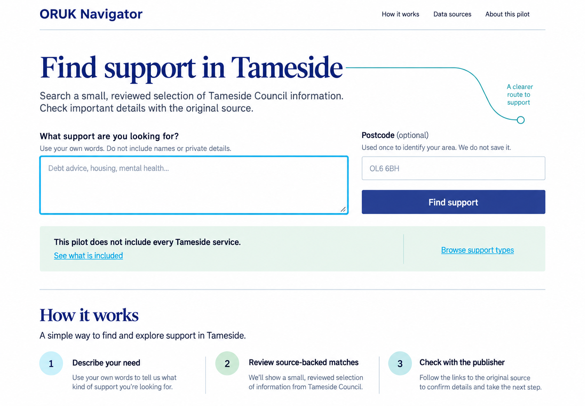

# ORUK Navigator

**Find local support that fits your needs.**

ORUK Navigator is an independent, open-source service-discovery project built around Open Referral UK data and standards. The current pilot focuses on Ashton-under-Lyne and Tameside, with Lancashire as the wider regional context.

It is not produced, endorsed, or maintained by iStandUK, iNetwork, Tameside Council, or Open Referral UK.



## Project map

### Live Product

The accessible public-journey prototype is implemented and production-buildable. Public hosting is not live yet; deployment remains a launch milestone.

Run it locally:

```bash
pnpm install
pnpm dev
```

Then open `http://localhost:3000`.

The working prototype includes:

- a privacy-conscious natural-language search task;
- deterministic matching over five reviewed Tameside service fixtures;
- field-backed “Why this matched” reasons;
- service details with authoritative source links and provenance;
- honest missing-information and limited-coverage language; and
- a validated correction-report journey that explicitly does not send or store reports yet.

### Architecture

- [Domain and PostgreSQL persistence boundary](docs/data-model.md)
- [Local database and migration workflow](docs/database.md)
- [Source admission and ingestion contract](docs/ingestion.md)
- [Ingestion trust boundary and threat model](docs/security/ingestion-threat-model.md)
- [Operational support boundary](docs/operations.md)
- Next.js App Router with TypeScript and React
- Implemented private PostgreSQL/Supabase schemas behind server-only application repositories

### Product / UX

- [Product definition and measurable v1 scope](docs/product.md)
- [Visual and interaction direction](DESIGN.md)
- [Browser-reviewed prototype fidelity record](docs/design/prototype-fidelity.md)
- Public journey: search → reviewed results → detail/provenance → source or correction

### ORUK Integration

- [Current ORUK and source research](docs/research.md)
- [Initial Tameside source manifest](docs/research/initial-source-manifest.md)
- [Tameside data-route decision](docs/research/tameside-data-route.md)
- Curated council pages are a transparent pilot bridge, not a claim of native ORUK feed coverage

### Search & AI

- [Deterministic ranking and evaluation contract](docs/search.md)
- [Measured semantic-search include/defer evaluation](docs/research/semantic-search-evaluation.md)
- Search works without an LLM, paid embedding API, or vector database
- AI and semantic retrieval remain optional behind interfaces and must demonstrate measurable value before inclusion

### Automation

- Allowlisted Tameside fetch → validation → extraction → review → immutable publication is implemented and tested locally
- Scheduled-source health, correction retention, alerting, and recovery boundaries are defined in [operations](docs/operations.md)
- CI/CD and deploy automation are upcoming implementation milestones

### Accessibility

- WCAG 2.2 AA target
- Semantic landmarks, headings, labels, fieldsets, error summaries, and keyboard-visible focus
- 48px minimum control targets and responsive browser checks at 1280×720 and 390×844
- Accessibility is a release gate, not a visual-design preference

### Security

- User search narratives and submitted postcodes are not placed in URLs, persisted, or intentionally logged
- External sources are untrusted and constrained by manifest, origin, content-type, size, timeout, and review boundaries
- Corrections cannot mutate catalogue data automatically
- [Privacy-first operating and retention model](docs/operations.md)

### Testing

```bash
pnpm test
pnpm typecheck
pnpm lint
pnpm build
pnpm db:test
pnpm test:repositories
pnpm test:e2e
```

The current checkpoint passes 52 unit/component/evaluation/ingestion tests, 48 pgTAP database checks, nine real-PostgreSQL repository integration scenarios, two isolated Chromium journeys, strict TypeScript checking, ESLint, and an optimized Next.js production build.

### ADRs

- [ADR 0001 — reviewed-source publication](docs/adr/0001-reviewed-source-publication.md)
- [ADR 0002 — private PostgreSQL domain boundary](docs/adr/0002-private-postgresql-domain-boundary.md)
- [ADR 0003 — deterministic search baseline](docs/adr/0003-deterministic-search-baseline.md)
- [ADR 0004 — minimal privacy-first operations](docs/adr/0004-minimal-privacy-first-operations.md)
- [ADR 0005 — defer semantic search from v1](docs/adr/0005-defer-semantic-search.md)

## Current status

The discovery prototype, core product/architecture decisions, private PostgreSQL foundation, reviewed Tameside ingestion workflow, and repository-backed public journey are complete, but the full production product is not finished. Key remaining work includes production correction persistence, scheduled ingestion/health monitoring, CI/CD, security/accessibility audits, deployment, and runbook rehearsal.

Track decisions and implementation work in [GitHub Issues](https://github.com/SayamDev/ORUK-Navigator/issues).

## Design identity

The interface uses an independent civic identity with deep navy, cyan, soft green, and teal—visually compatible with the iStandUK/iNetwork ecosystem without copying its logos or claiming affiliation. See [DESIGN.md](DESIGN.md) for the source-of-truth tokens and content rules.

## Repository principles

- Research authoritative sources before implementation.
- Never invent service facts, coverage, eligibility, availability, or endorsement.
- Prefer deterministic, explainable behaviour over unnecessary AI.
- Treat accessibility, privacy, security, testing, and operations as product requirements.
- Keep infrastructure portable and free-first where practical.

## Licence

A project-code licence has not yet been selected. Source-data and content licensing are separate concerns; see [licensing research](docs/research/licensing.md) before reusing third-party material.
