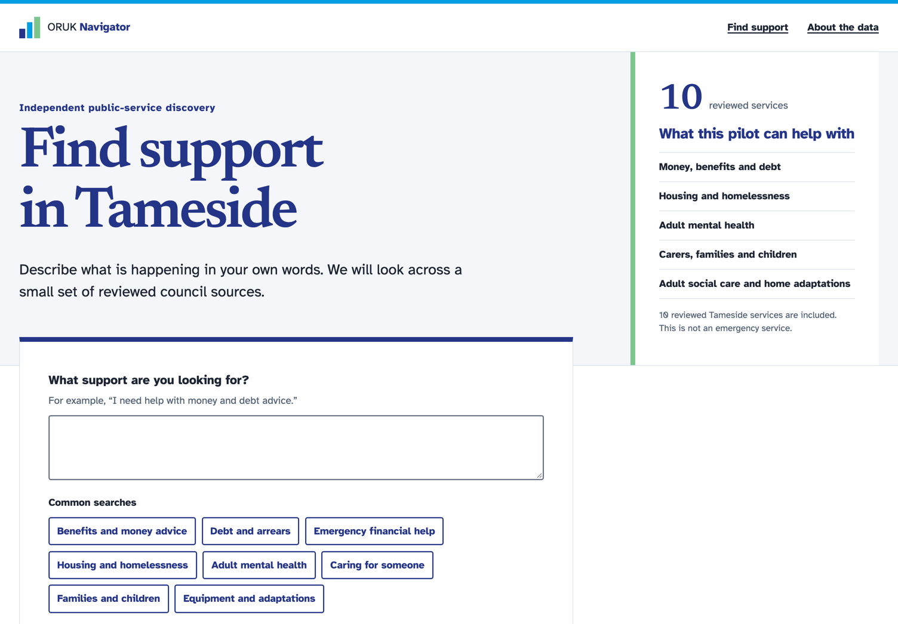

# ORUK Navigator

**Find local support that fits your needs.**

ORUK Navigator is an independent, open-source service-discovery project built around Open Referral UK data and standards. The current pilot focuses on Ashton-under-Lyne and Tameside, with Lancashire as the wider regional context.

It is not produced, endorsed, or maintained by iStandUK, iNetwork, Tameside Council, or Open Referral UK.



<sub>The live service on 17 September 2026. The original design concept is kept at [docs/design/concepts/home-search.png](docs/design/concepts/home-search.png) and the fidelity comparison in [docs/design/prototype-fidelity.md](docs/design/prototype-fidelity.md).</sub>

## Project map

### Live Product

The accessible public-journey prototype is live at [oruk-navigator.vercel.app](https://oruk-navigator.vercel.app). It runs on Vercel with a dedicated Free Plan Supabase database in the UK region.

Run it locally:

```bash
pnpm install
pnpm dev
```

Then open `http://localhost:3000`.

The working prototype includes:

- a privacy-conscious natural-language search task;
- deterministic matching over ten reviewed Tameside service fixtures;
- field-backed “Why this matched” reasons;
- service details with authoritative source links and provenance;
- honest missing-information and limited-coverage language;
- a server-validated correction-report journey with random references and privacy-bounded storage, gated until fallback ownership is configured; and
- a public technical-status page that separates source-checking health from service availability.

### Architecture

- **[Architecture walkthrough](docs/architecture-walkthrough.md)** — start here: how a request travels, from public search to reviewed publication to published ORUK data
- [Domain and PostgreSQL persistence boundary](docs/data-model.md)
- [Local database and migration workflow](docs/database.md)
- [Source admission and ingestion contract](docs/ingestion.md)
- [Ingestion trust boundary and threat model](docs/security/ingestion-threat-model.md)
- [Operational support boundary](docs/operations.md)
- Next.js App Router with TypeScript and React
- Implemented private PostgreSQL/Supabase schemas behind server-only application repositories

### Product / UX

- [Product definition and measurable v1 scope](docs/product.md)
- [Visual and interaction direction](DESIGN.md)
- [Browser-reviewed prototype fidelity record](docs/design/prototype-fidelity.md)
- Public journey: search → reviewed results → detail/provenance → source or correction

### ORUK Integration

- **[ORUK v3 publishing feed](docs/oruk-feed.md)** — the reviewed Tameside catalogue published as an HSDS-UK-3.0 API at [`/api/oruk/v3`](https://oruk-navigator.vercel.app/api/oruk/v3), so partners can reuse it instead of re-keying council pages
- **[Feed interoperability](https://oruk-navigator.vercel.app/interoperability)** — live probes of published ORUK feeds (Shropshire, Bristol, Dorset) reporting version, size and field completeness
- **[`tools/OrukFeedCheck`](tools/README.md)** — a .NET 10 command-line checker for the data quality of any ORUK v3 feed, with its tests run in CI
- [Validator relationship](docs/validator-alignment.md) — what Navigator reuses, what it demonstrates, and where the official validator remains authoritative
- [Current ORUK and source research](docs/research.md)
- [Initial Tameside source manifest](docs/research/initial-source-manifest.md)
- [Tameside data-route decision](docs/research/tameside-data-route.md)
- Curated council pages are a transparent pilot bridge, not a claim of an official council ORUK feed

### Search & AI

- [Deterministic ranking and evaluation contract](docs/search.md)
- [Measured semantic-search include/defer evaluation](docs/research/semantic-search-evaluation.md)
- Search works without an LLM, paid embedding API, or vector database
- AI and semantic retrieval remain optional behind interfaces and must demonstrate measurable value before inclusion

### Automation

- Allowlisted Tameside fetch → validation → extraction → review → immutable publication is implemented and tested locally
- Weekly source-alert reconciliation and correction retention are automated with concurrency and deduplicated failure issues
- [Correction, alert, and retention runbook](docs/runbooks/corrections-and-retention.md)
- Production deployment is live; source checks are manual while the live-page extractor is repaired after the first production exercise. Changes are never published automatically.

### Standards

- **[GDS Service Standard self-assessment](docs/gds-service-standard.md)** — all 14 points, with evidence and the points this pilot does not meet

### Accessibility

- WCAG 2.2 AA target
- Semantic landmarks, headings, labels, fieldsets, error summaries, and keyboard-visible focus
- 48px minimum control targets and responsive browser checks at 1280×720, 390×844, and 320×720
- Accessibility is a release gate, not a visual-design preference
- [Accessibility release review and remaining human screen-reader gate](docs/accessibility-review.md)
- [Usability and assistive-technology test plan](docs/research/usability-and-assistive-tech-plan.md)
- [First live source-check exercise and findings](docs/operations/source-check-exercise-2026-09-24.md)
- [Private source-candidate review runbook](docs/runbooks/source-candidate-review.md)

### Security

- User search narratives and submitted postcodes are not placed in URLs, persisted, or intentionally logged
- External sources are untrusted and constrained by manifest, origin, content-type, size, timeout, and review boundaries
- Corrections cannot mutate catalogue data automatically
- Correction text, short-lived keyed abuse controls, append-only review history, and allowlisted events live in a private operations schema
- [Privacy-first operating and retention model](docs/operations.md)
- [Security and privacy release review](docs/security/release-review.md)

### Testing

```bash
pnpm test
pnpm typecheck
pnpm lint
pnpm build
pnpm db:test
pnpm test:repositories
pnpm test:e2e
```

The current checkpoint passes 59 unit/component/evaluation/ingestion tests, 63 pgTAP database checks, 14 real-PostgreSQL repository integration scenarios, and 27 production-mode Chromium checks across desktop, 390px, and 320px. CI also enforces strict TypeScript, ESLint, a production build, secret scanning, dependency review, and a production dependency audit.

[Deployment, verification, recovery, and rollback runbook](docs/runbooks/deployment-and-rollback.md)

### ADRs

- [ADR 0001 — reviewed-source publication](docs/adr/0001-reviewed-source-publication.md)
- [ADR 0002 — private PostgreSQL domain boundary](docs/adr/0002-private-postgresql-domain-boundary.md)
- [ADR 0003 — deterministic search baseline](docs/adr/0003-deterministic-search-baseline.md)
- [ADR 0004 — minimal privacy-first operations](docs/adr/0004-minimal-privacy-first-operations.md)
- [ADR 0005 — defer semantic search from v1](docs/adr/0005-defer-semantic-search.md)

## Current status

The discovery prototype, core product/architecture decisions, private PostgreSQL foundation, reviewed Tameside ingestion workflow, repository-backed public journey, correction persistence, source-alert reconciliation, retention automation, release pipeline, dedicated Free Plan production database, and public Vercel deployment are implemented. The first live source-check run exposed a mismatch between fixture selectors and real council markup; its schedule is paused pending remediation. Public correction intake is intentionally disabled because no fallback operator is available. The full production product is not finished: live-source extraction, review-queue operation, managed-backup verification, and human usability and screen-reader passes remain.

Track decisions and implementation work in [GitHub Issues](https://github.com/SayamDev/ORUK-Navigator/issues).

## Design identity

The interface uses an independent civic identity with deep navy, cyan, soft green, and teal—visually compatible with the iStandUK/iNetwork ecosystem without copying its logos or claiming affiliation. See [DESIGN.md](DESIGN.md) for the source-of-truth tokens and content rules.

## Repository principles

- Research authoritative sources before implementation.
- Never invent service facts, coverage, eligibility, availability, or endorsement.
- Prefer deterministic, explainable behaviour over unnecessary AI.
- Treat accessibility, privacy, security, testing, and operations as product requirements.
- Keep infrastructure portable and free-first where practical.

## Licence

A project-code licence has not yet been selected. Source-data and content licensing are separate concerns; see [licensing research](docs/research/licensing.md) before reusing third-party material.
